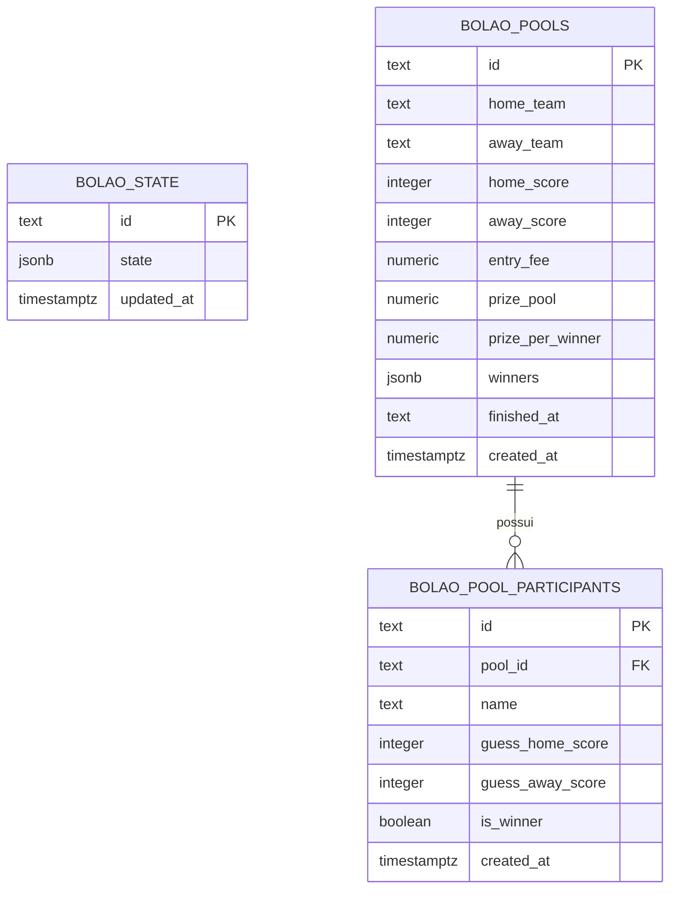

# Modelo de dados do Bolao Adega Camisa 10

Este documento descreve as tabelas usadas no Supabase para armazenar os dados
do sistema de bolao.

## Visao geral

O app usa tres tabelas principais:

- `bolao_state`: guarda o estado atual do app.
- `bolao_pools`: guarda cada bolao finalizado.
- `bolao_pool_participants`: guarda os participantes de cada bolao finalizado.

## Tabelas

### bolao_state

Guarda o estado atual do sistema. Ela funciona como o arquivo vivo do app,
mantendo jogo atual, placar atual, participantes cadastrados no bolao em
andamento, valor do palpite e configuracoes gerais.

Campos:

| Campo | Tipo | Descricao |
| --- | --- | --- |
| `id` | `text` | Identificador do registro principal. No app usamos `default`. |
| `state` | `jsonb` | JSON com o estado atual do sistema. |
| `updated_at` | `timestamptz` | Data e hora da ultima atualizacao. |

### bolao_pools

Guarda o historico principal dos boloes finalizados. Cada linha representa um
bolao/jogo encerrado.

Campos:

| Campo | Tipo | Descricao |
| --- | --- | --- |
| `id` | `text` | Identificador unico do bolao finalizado. |
| `home_team` | `text` | Nome do time da casa. |
| `away_team` | `text` | Nome do time visitante. |
| `home_score` | `integer` | Placar final do time da casa. |
| `away_score` | `integer` | Placar final do time visitante. |
| `entry_fee` | `numeric` | Valor cobrado por palpite. |
| `prize_pool` | `numeric` | Premio total acumulado. |
| `prize_per_winner` | `numeric` | Valor recebido por cada vencedor. |
| `winners` | `jsonb` | Lista com os nomes dos vencedores. |
| `finished_at` | `text` | Data/hora exibida no historico do app. |
| `created_at` | `timestamptz` | Data/hora de criacao do registro no Supabase. |

### bolao_pool_participants

Guarda os participantes e palpites ligados a cada bolao finalizado.

Campos:

| Campo | Tipo | Descricao |
| --- | --- | --- |
| `id` | `text` | Identificador unico do participante no historico. |
| `pool_id` | `text` | Chave estrangeira que liga o participante ao bolao em `bolao_pools.id`. |
| `name` | `text` | Nome do participante. |
| `guess_home_score` | `integer` | Palpite de gols do time da casa. |
| `guess_away_score` | `integer` | Palpite de gols do time visitante. |
| `is_winner` | `boolean` | Indica se o participante acertou o placar final. |
| `created_at` | `timestamptz` | Data/hora de criacao do registro no Supabase. |

## Relacionamento

Um bolao finalizado pode ter varios participantes.

```text
bolao_pools 1 ---- N bolao_pool_participants
```

O campo que cria essa ligacao e:

```text
bolao_pool_participants.pool_id -> bolao_pools.id
```

## MER em Mermaid



## Desenho simplificado

```text
                 +--------------------+
                 |    bolao_state     |
                 |--------------------|
                 | id                 |
                 | state              |
                 | updated_at         |
                 +--------------------+
                         |
                         | guarda o estado atual do app
                         |


+----------------------------+          +------------------------------+
|        bolao_pools         |          |   bolao_pool_participants    |
|----------------------------|          |------------------------------|
| id                         |<---------| pool_id                      |
| home_team                  |    1:N   | id                           |
| away_team                  |          | name                         |
| home_score                 |          | guess_home_score             |
| away_score                 |          | guess_away_score             |
| entry_fee                  |          | is_winner                    |
| prize_pool                 |          | created_at                   |
| prize_per_winner           |          +------------------------------+
| winners                    |
| finished_at                |
| created_at                 |
+----------------------------+
```

## Responsabilidade de cada tabela

```text
Estado atual -> bolao_state
Historico dos boloes -> bolao_pools
Participantes do historico -> bolao_pool_participants
```
